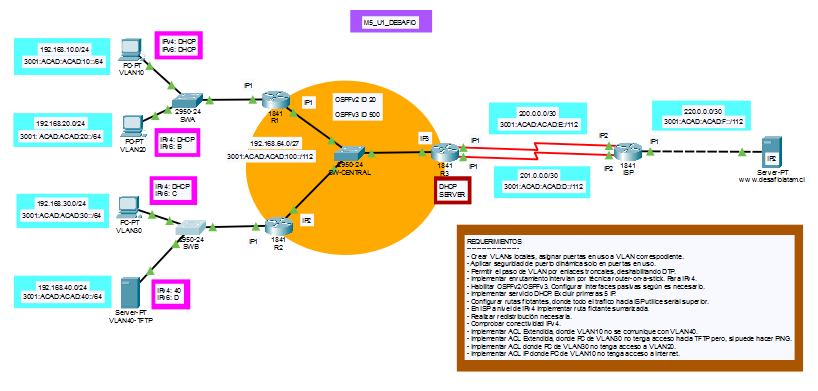

# M5D1_Implementacion_Red

Implementación de red empresarial en **Cisco Packet Tracer**, con segmentación mediante VLANs, enrutamiento inter-VLAN (Router-on-a-Stick), DHCP centralizado, enlaces troncales y seguridad de puertos.

## 🧭 Objetivo

Aplicar los conocimientos de configuración de VLANs, enrutamiento, DHCP y ACLs en un entorno simulado de red jerárquica.

## 🗺 Topología



## 📦 Contenido

```bash
| Carpeta          | Descripción                                                         |
| ---------------- | ------------------------------------------------------------------- |
| `/docs`          | Informe técnico y comandos utilizados                               |
| `/packet-tracer` | Archivo del proyecto `.pkt`                                         |
```

## 🔧 Tecnologías implementadas

- VLANs 10, 20, 30, 40
- Router-on-a-Stick
- DHCP centralizado
- OSPFv2 y rutas flotantes
- Seguridad de puertos
- Troncales 802.1Q sin DTP
- ACL extendidas (seguridad y control de tráfico)

## ▶️ Cómo usar

1. Abre `M5_U1.pkt` en **Cisco Packet Tracer 8.x o superior**.
2. Consulta las configuraciones en `/configs`.
3. Revisa el documento `/docs/Informe.md` para comprender el diseño y las decisiones de red.

## 👤 Autor

**Aldo Yáñez**  
\_Bootcamp Talento Digital — 2025
